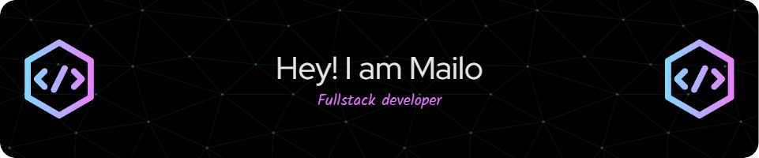

# 💫 About Me:
👋 Hi there, I'm Mailootje!
🔭 I’m currently working on expanding my coding skills, especially in JavaScript and Python, focusing on projects that enhance everyday productivity and solve real-world problems. I’m passionate about open source and actively contribute to projects that pique my interest.

🌱 I’m on a learning spree, exploring new technologies and frameworks. I believe in lifelong learning and am always eager to understand more about AI, cloud computing, and mobile app development.

👯 I’m looking to collaborate on innovative projects in machine learning and IoT. If you're looking for a teammate who brings enthusiasm and insight to the table, let’s connect!

📫 How to reach me: Drop me a message on GitHub or connect with me on LinkedIn.

💬 Ask me about: JavaScript quirks, Python tips, and anything tech. I love discussing emerging tech trends and sharing what I’ve learned on my coding journey.

🎉 Fun fact: I’m not only a tech enthusiast but also an amateur astronomer. I enjoy star gazing and tracking celestial events.

🌟 I'm driven by curiosity and the thrill of solving complex problems. Let's make something awesome together!!

## 💰 You can help me by Donating so i can get a coffee :)
 

## 🌐 Socials:
- **Instagram**: 
- **TikTok**: 
- **YouTube**: 
- **Twitch**: 
- **Twitter**: 
- **LinkedIn**: 
- **Discord**: 
- **Spotify**: 
- **Reddit**: 
- **Medium**: 
- **GitHub**: 
- **Steam**: 

## 🏆 𝗚𝗶𝘁𝗛𝘂𝗯 𝗧𝗿𝗼𝗽𝗵𝗶𝗲𝘀

# 💻 Tech Stack:

## Programming Languages:
 
 
 
 
 

## Frontend Development:
 
 
 
 
 
 

## Backend Development:
 
 
 

## Databases:
 
 
 

## Tools & Development Platforms:
 
 
 
 

## Design:
 
 
 

# 📊 GitHub Stats:

---
<!--  -->

